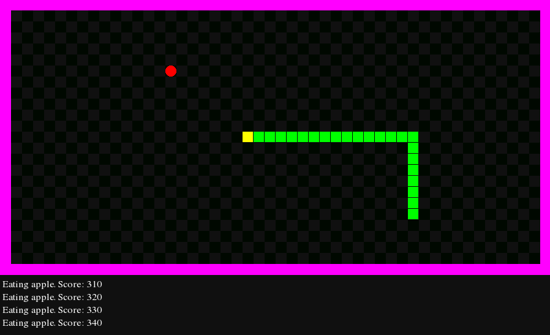

# snakegame
Classical snake game



## Building:

To build it you should be familiar with ```CMake```. Clone this repository, run ```CMake```, configure the project by specifying the path to SFML library (the recommended version of SFML is 2.5.1) and other appropriate options you would like to adjust. Generate necessary files, build this game and have fun!
